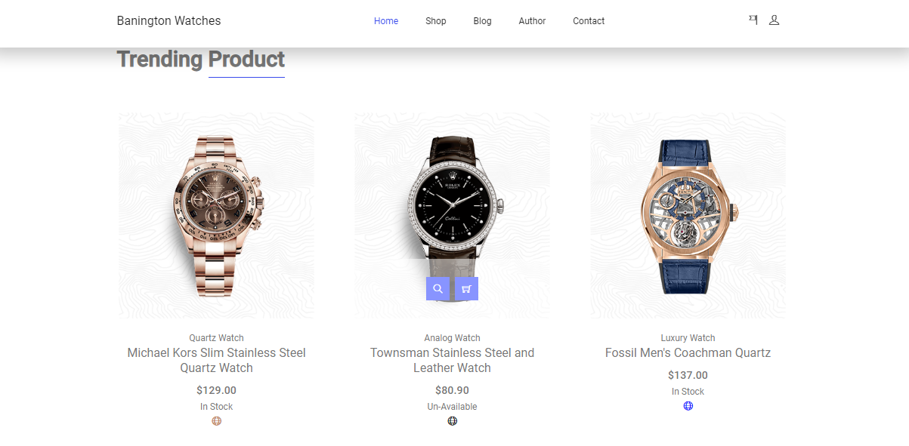

# Project-BaningtonWatches
E-commerce web store application for buying branded watches. The page was created in the base PHP language, where it provides users with the search and purchase of watches at a given price.
Welcome to the E-commerce Web Store! This web application is designed to provide users with the ability to search and purchase branded watches at a given price. The project is built using the base PHP language to offer a simple yet effective solution for buying high-quality watches online.

## Screanshots
</img>
</img>
</img>
</img>

## Features

Our Branded Watches E-commerce Web Store comes with the following features:

- **Product Search**: Easily search for branded watches based on criteria like price.
- **Product Listings**: Browse a wide selection of branded watches.
- **Product Details**: View detailed information and images for each watch.
- **User Registration and Login**: Secure user accounts to manage purchases.
- **Shopping Cart**: Add watches to your cart and proceed to checkout.
- **Checkout Process**: Simple and secure checkout with payment options.
- **Order History**: Keep track of your order history.
- **Responsive Design**: Ensures a seamless shopping experience on all devices.

## Getting Started

To get started with the Branded Watches E-commerce Web Store, make sure you have the following prerequisites:

- A web server with PHP support
- A MySQL database
- Basic knowledge of web development

## Installation

Follow these steps to set up the project on your local environment:

1. Clone this repository to your local machine:

   ```bash
   git clone https://github.com/your-username/branded-watches-ecommerce.git
